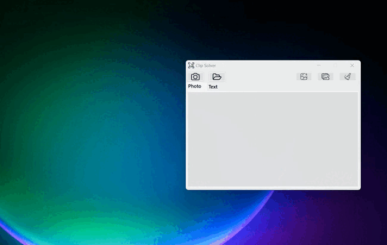

<h1 style="text-align: center;">Clip Solver by Suwi-inc</h1>
  <p style="text-align: center;">
   
   </p>
   
## Overview
This Snipping and Text Extraction is a handy utility designed to make capturing and extracting content from your screen easier. Whether you need to capture a screenshot, select a specific area of the screen, or extract text from images, this app has you covered

## Installation Guide
### 1. Clone the github repo to your prefered directory using
```
git clone https://github.com/Suwi-inc/WindowsClipSolver.git
``` 
### 2. Navigate to the root directory of the project
```
cd path to repo directory/windowsclipsolver 
```

### 3. Build the application using
```
dotnet build
```
### 4. Run the application using
```
dotnet run
```
## Main Functionalities

### 1. Capture Screenshot
- Allows users to capture part or all of their screen
- Provides a user-friendly interface for precise selection

### 2. Open custome Image 
- Allows users to open existing images stored on their system
- Supports JPEG, PNG and BMP

### 3. Copy Image to clipboard 
- Allows users to to copy the captured or opened image to the clipboard
- Copied image can be pasted to any other application which has pasting enabled

### 4. Save Image to disk 
- Allows users to save the captured screenshot to the disk
- Supports JPEG,PNG and BMP

### 5. Extract Text from Image
- Utilizes OCR (Optical Character Recognition) technology to extract text from images
- Uses the fast and higly capable tesseract .net wraper for quick and precise text extraction
- Provides accurate and reliable text extraction even from complex images
- Currently Supports Latin and Cyrillic charecter sets and multiple fonts for text recognition
- Displays extracted text in a readable format for easy access

### 6. Copy extracted text to clipboard 
- Allows users to to copy the extracted text from the image to the clipboard
- Copied imtextage can be pasted to any other application which has pasting enabled

### 7. Save extracted text to textfile 
- Allows users to save the extracted text from the image into a textfile


## How to Use
1. **Capture Screenshot:** 
   - Click on the "Capture" button.
   - Drag and resize the selection box to choose the desired area.
   - Confirm the selection to capture the chosen area by releasing the mouse button.

      

2. **Open Image:**
   - Click on the "Open" button.
   - Navigate to the location of the image on your system.
   - Select the image file and click "Open" to load it into the app.

      

3. **Extract Text from Image:**
   - Open the desired image containing text.
   - Click on the "Extract Text" button.
   - Wait for the app to process the image and display the extracted text.

      

4. **Copy Image to clipboard:**
   - Take a screenshot
   - Click on the 'Copy Image' buttom
   - Image is now copied to the clipboard

5. **Save Image to disk:**
   - Take a screenshot
   - Click on the 'Save Image' buttom
   - Enter a name for the image and click save

6. **Copy Text to clipboard:**
   - Take a screenshot
   - Click on the 'Text' window to extract the text from the image
   - Click on the 'Copy Text' buttom
   - Text is now copied to the clipboard

7. **Save Text to disk:**
   - Take a screenshot
   - Click on the 'Text' window to extract the text from the image
   - Click on the 'Save Text' buttom
   - Enter a name for the text file and click save

## System Requirements
- Compatible with Windows operating systems (Windows 7 and above).
- Requires .net 6 or higher.
- Minimum of 150 MB of free disk storage.
- Minimum RAM requirements to run the Windows 7 Operating system.

### Feedback
If you encounter any bugs or have any sugetions you can reach out to me at:
- Email📧: suwi101silwamba@gmail.com
- Telegram🧔🏿‍♂️: [@Suwi_Inc](https://t.me/Suwi_inc)
