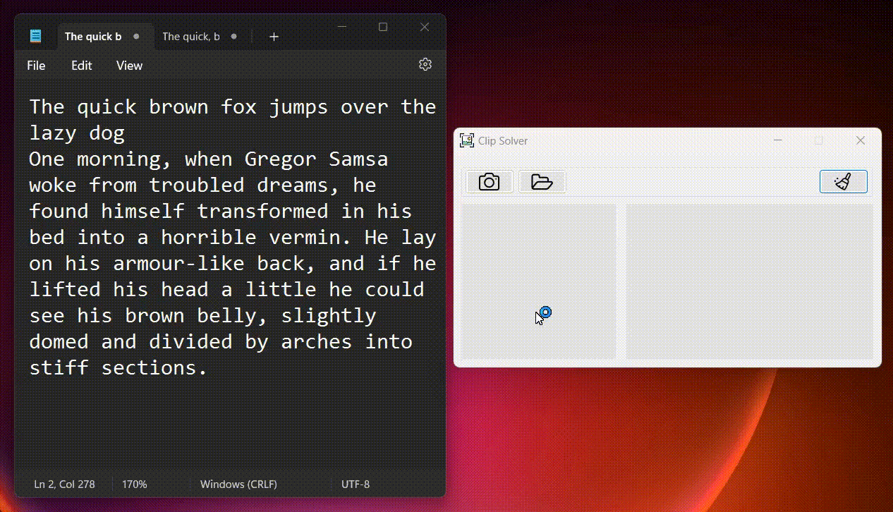
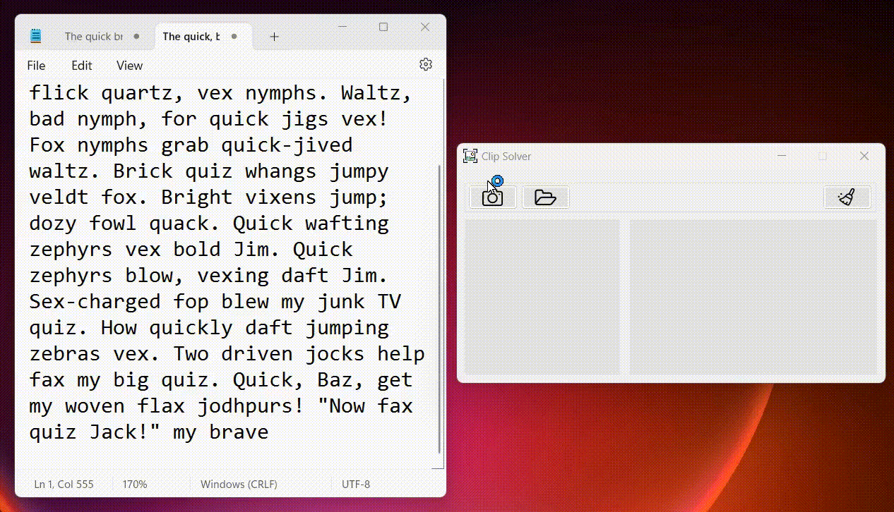

#  Clip Solver by Suwi-inc

## Overview
This Snipping and Text Extraction is a handy utility designed to make capturing and extracting content from your screen easier. Whether you need to capture a screenshot, select a specific area of the screen, or extract text from images, this app has you covered.

## Main Functionalities

### 1. Capture Screenshot
- Allows users to capture part or all of their screen.
- Provides a user-friendly interface for precise selection.

### 2. Open custome Image 
- Allows users to open existing images stored on their system.
- Supports various image formats including JPEG, PNG, and BMP.
 ##### and the most exiting feature...  
### 3. Extract Text from Image
- Utilizes OCR (Optical Character Recognition) technology to extract text from images.
- Uses the fast and higly capable tesseract .net wraper for quick and precise text extraction.
- Provides accurate and reliable text extraction even from complex images.
- Currently Supports Latin and Cyrillic charecter sets and multiple fonts for text recognition.
- Displays extracted text in a readable format for easy access.

## How to Use
1. **Capture Screenshot:** 
   - Click on the "Capture" button.
   - Drag and resize the selection box to choose the desired area.
   - Confirm the selection to capture the chosen area by releasing the mouse button.

      

2. **Open Image:**
   - Click on the "Open" button.
   - Navigate to the location of the image on your system.
   - Select the image file and click "Open" to load it into the app.

      

3. **Extract Text from Image:**
   - Open the desired image containing text.
   - Click on the "Extract Text" button.
   - Wait for the app to process the image and display the extracted text.

      

## Upcoming Features
- **Save and Share:** Allows users to save captured screenshots and extracted text to their desired location or share them with others.
- **Clipboard Support:** Automatically copies captured screenshots and extracted text to the clipboard for easy pasting into other applications.
- **Customization Options:** Provides various customization options such as hotkeys, file naming conventions, and output formats.

## System Requirements
- Compatible with Windows operating systems (Windows 7 and above).
- Requires .net 6 or higher.
- Minimum of 50MB of free disk storage.
- Minimum RAM requirements to run the Windows 7 Operating system.

### Feedback
If you encounter any bugs or have any sugetions you can reach out to me at:
- Email📧: suwi101silwamba@gmail.com
- Telegram🧔🏿‍♂️: [@Suwi_Inc](https://t.me/Suwi_inc)
